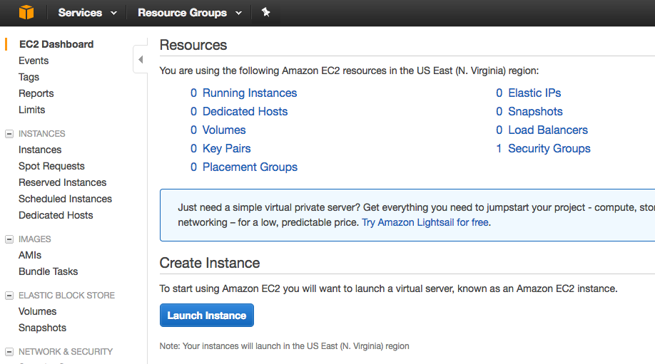

### Nginx Setup
- Log into the AWS console. Select EC2 and then Launch Instance:
    
    - Choose the type of Operating System for our EC2 Virtual Machine
        - The Amazon Linux AMI comes with a whole lot of pre-built in tools including the AWS CLI, the popular programming languages and databases.
        - We will choose `Amazon Linux 2 AMI (HVM), SSD Volume Type`
        
    - Please choose `t2.micro` as instance type
    
    - in `Configure Instance Details`, choose default for everything except `userdata`
        - VPC stands for Virtual Private Cloud.
        - One subnet is tied to one Availability Zone.
        - IAM stands for Identity Access Management and is used to manage permissions.
        - It is done with the use of user Data script
            ```
            #!/bin/bash
            yum update -y
            yum install -y httpd
            systemctl start httpd
            systemctl enable httpd
            echo "Hello from $(hostname -f)" > /var/www/html/index.html
            ```
    - Select Elastic Block Storage
        - EBS is used to create storage volumes that attach to EC2 virtual machines. With EBS we can create filesystems, run databases and other cool stuff.
        - There are three different storage types for root EBS volumes: General Purpose SSD (GP2), Provisioned IOPS SSD (IO1) and Magnetic HDD. SDD stands for Solid State Drive and HDD is Hard Disk Drive.
        - EBS Volume is a virtual hard disk in the cloud. Root means it is where we are going to boot our Operating System from (such as Windows or in our case Linux).
        - Delete on Termination means the EBS will be deleted if we delete the EC2 instance.
        
    - Select/Create Tags & Security Group
        - Tags help you control costs. They help you see where your AWS costs are coming from. Tag everything and tag as much as possible.
        - Security Groups are virtual firewalls. The Security Rules define what type of traffic we want to allow through. We want to SSH into our EC2 so we can do things like install Apache. We want to view the website so we’ll allow HTTP and HTTPS.
        
        
    - Review and Launch
        
        
    - Wiat for the instance to be up and than test it out.
        
        
    - SSH into our machine to install the web server
        - Connect via the AWS Console
        - Connect via SSH CLI
            ```
            $ mkdir SSH
            $ mv `awslearn.pem` SSH
            $ cd SSH
            $ chmod 400 `awslearn.pem`
            $ ssh -i EC2KeyPair.pem ec2-user@35.167.216.64
            ```
            