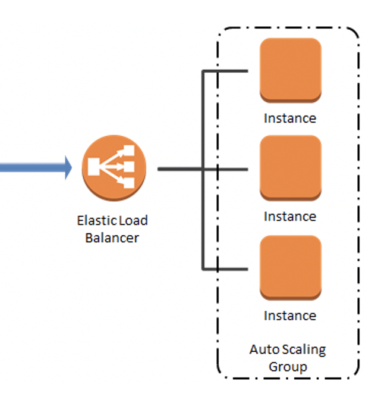

## Elastic Load Balancers

#### Whqat is a Load Balancer?
- Users cannot remember different/multiple endpoints or IP addresses of different servers running behind. They need one endpoint which they can hit and ultimately that endpoint will route and map the request to the appropriate server and that single endpoint can be created by load balancers.
- Its there to forward traffic to multiple servers (e.g., EC2 instances) downstream 
- Spread load across multiple downstream instances
- Expose a single point of access (DNS) to your application
- Seamlessly handle failures of downstream instances
- Do regular health checks to your instances
- Provide SSL termination (HTTPS) for your websites
- Enforce stickiness with cookies
- High availability across zones
- Separate public traffic from private traffic 
- We get a single endpoint with a load balancer and there are different types of load balancers available.
- There are few different types od Load Balancers.
    - Hardware Load balancer
        - Physical machines in datacenters. E.g.- F5, Cisco ACE, etc.
    - Software based Load balancer
        - Apache Http service, Nginx, HA Proxy, etc.
    - Cloud based Load balancer
        - In AWS we have AWS ELB, so instead of setting up a load balancer on your own, we can use ELB service.
        - AWS ELB provides three types of Load Balancers
            - Classic Load Balancer (CLB)
            - Application Load Balancer (ALB)
            - Network Load Balancer (NLB)

#### Elastic Load Balancer (ELB)
- An Elastic Load Balancer is a managed load balancer
    - AWS guarantees that it will be working
    - AWS takes care of upgrades, maintenance, high availability
    - AWS provides only a few configuration knobs 
- Elastic Load Balancing (ELB) automatically distributes incoming application traffic across multiple targets, such as Amazon EC2 instances, containers, and IP addresses 
- ELB Health Checks
    - They enable the load balancer to know if instances it forwards traffic to are available to reply to requests 
    - The health check is done on a port and a route (/health is common) 
    - If the response is not 200 (OK) or in some cases lookout for some response text like `Health Check OK` then the instance is unhealthy
- Elastic Load Balancing offers three types of load balancers: 
    - Application Load Balancer 
    - Network Load Balancer 
    - Classic Load Balancer 


#### Setup Classic Load Balancer
#### Setup Application Load Balancer
#### Setup Network Load Balancer

### Markdown

Markdown is a lightweight and easy-to-use syntax for styling your writing. It includes conventions for

```markdown
Syntax highlighted code block

# Header 1
## Header 2
### Header 3

- Bulleted
- List

1. Numbered
2. List

**Bold** and _Italic_ and `Code` text

[Link](url) and 
```

### Support or Contact

Having trouble with Pages? Check out our [documentation](https://docs.github.com/categories/github-pages-basics/) or [contact support](https://support.github.com/contact) and we’ll help you sort it out.
