## How Classic Load Balancers work
1. Your client makes a request to your application.
2. The listeners in your load balancer receive requests of the matching protocol and port.
3. Each listener forwards requests to registered instances which are considered healthy according to health checks you configure. TCP listeners apply round robin routing while HTTP/HTTPS listeners apply the least outstanding requests algorithm. You can add or remove instances from your load balancer as needed without disrupting the overall flow of requests to your application.

```Note: Classic load balancers cannot route to target groups. As per AWS documentation, AWS will be retiring the EC2-Classic network on August 15, 2022.```

### Internal Classic Load Balancers
- When you create a load balancer in a VPC, you must choose whether to make it an internal load balancer or an internet-facing load balancer.
- The nodes of an internet-facing load balancer have public IP addresses. The DNS name of an internet-facing load balancer is publicly resolvable to the public IP addresses of the nodes. Therefore, internet-facing load balancers can route requests from clients over the internet
- The nodes of an internal load balancer have only private IP addresses. The DNS name of an internal load balancer is publicly resolvable to the private IP addresses of the nodes. Therefore, internal load balancers can only route requests from clients with access to the VPC for the load balancer.
- If your application has multiple tiers, for example web servers that must be connected to the internet and database servers that are only connected to the web servers, you can design an architecture that uses both internal and internet-facing load balancers. Create an internet-facing load balancer and register the web servers with it. Create an internal load balancer and register the database servers with it. The web servers receive requests from the internet-facing load balancer and send requests for the database servers to the internal load balancer. The database servers receive requests from the internal load balancer.
- When an internal load balancer is created, it receives a public DNS name with the following form:

    internal-name-123456789.region.elb.amazonaws.com
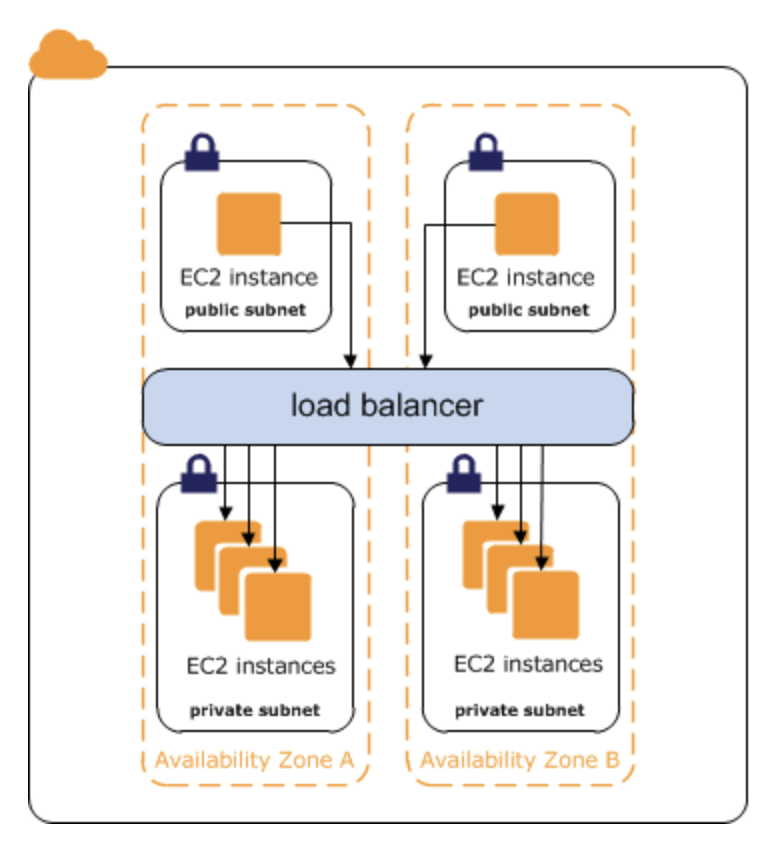

## Setting up Classic Load Balancer (CLB)

- Follow instructions [here](../ec2/nginx-setup.md) to setup EC2 instance.
- Follow following steps to setup a Classic Load Balancer (CLB).
    - Go to the EC2 service view and click on `Create Load Balancer`
    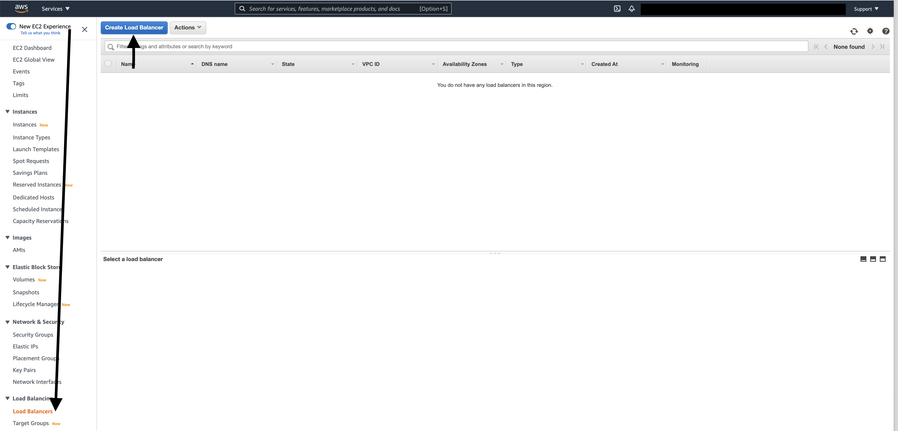
    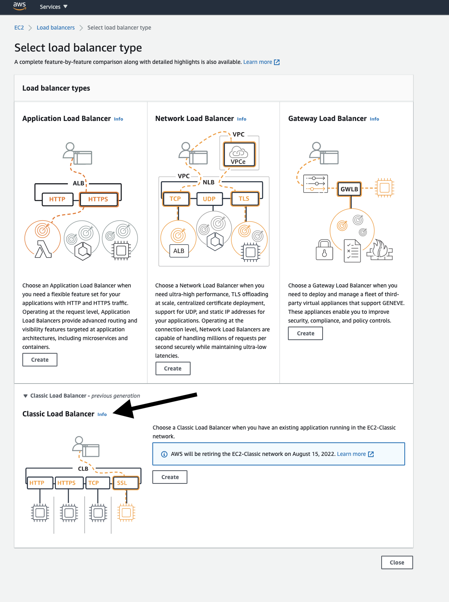
    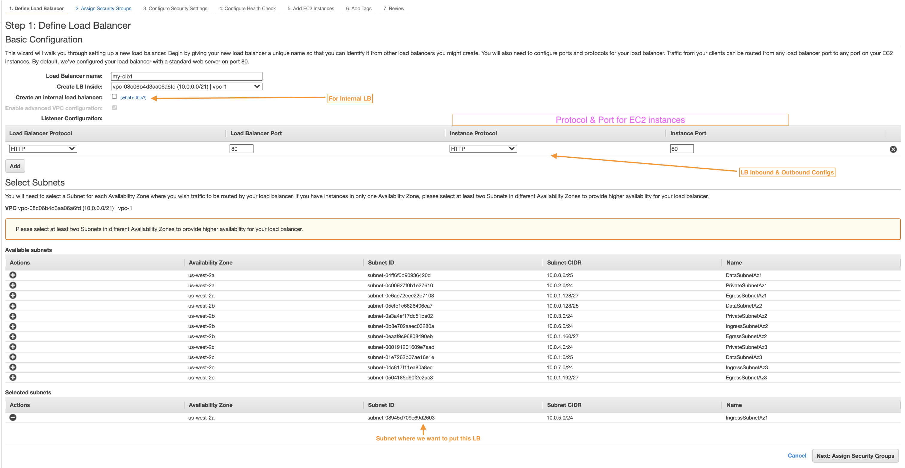
    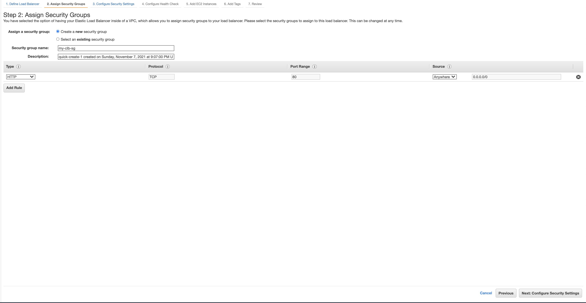
    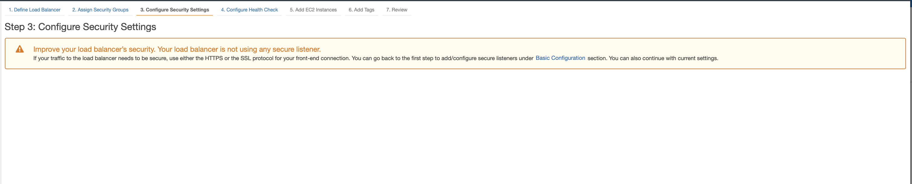
    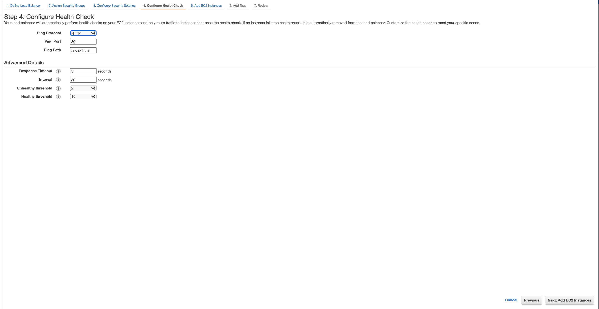
        - **`Response Timeout`**: Amount of time between health checks (5 sec - 300 sec).
        - **`Interval`**: Amount of time between health checks (5 sec - 300 sec).
        - **`Unhealthy threshold`**: Number of consecutive health check failures before declaring an EC2 instance unhealthy.
        - **`Healthy threshold`**: Number of consecutive health check successes before declaring an EC2 instance healthy.
    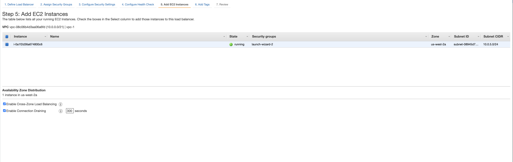
    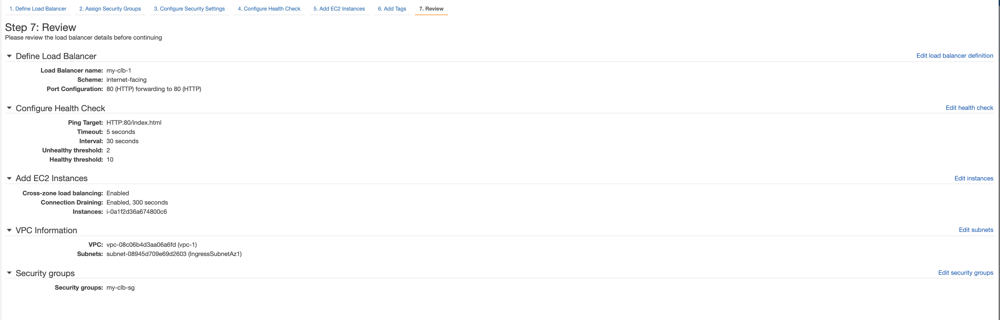
    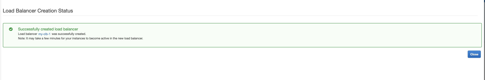
    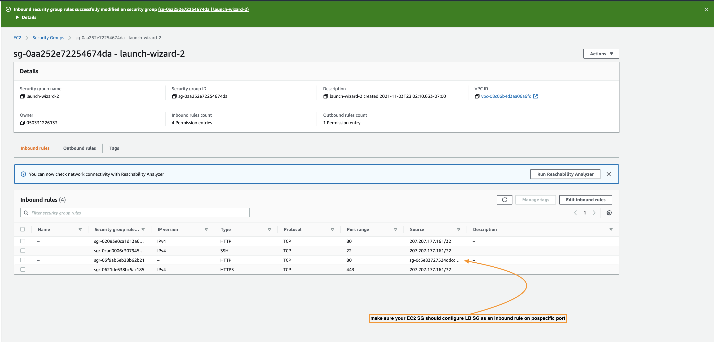
        - ```EC Security group inbound rule should add LB SG on specific port.```
    - Unhealthy LB
        - It could be due to the reason that EC2 instance Security group is not configured with LB SG as an inbound rule.
        - In order to mimin LB Instanced `OutOfService` status, simply either:-
            - Configure wrong endpoint for LB Health Check configs
            - configure EC2 instance with bad LB SG configs.
    - To further tighten the security to only allows certain audeinces who can access our EC2 instance (web application), remove port 80/443 direct access from EC2 instance SG inbound rules. 
    - **Test with Mutiple EC2 Instances**
        - we can setuop more EC2 instances
        - Add my EC2 instances to the LB
        - Test out with index.html with LB DNS endpoint and you will see ip address coming differently when as there are multiple EC2 instances.
        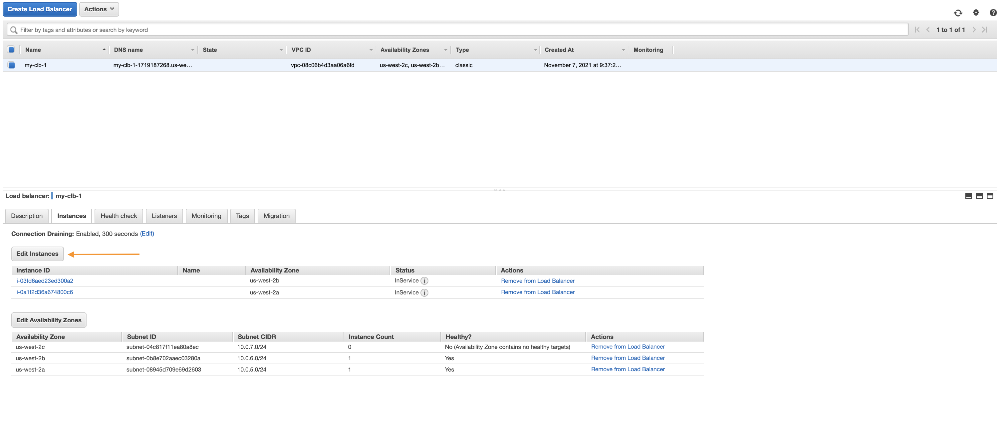
    
