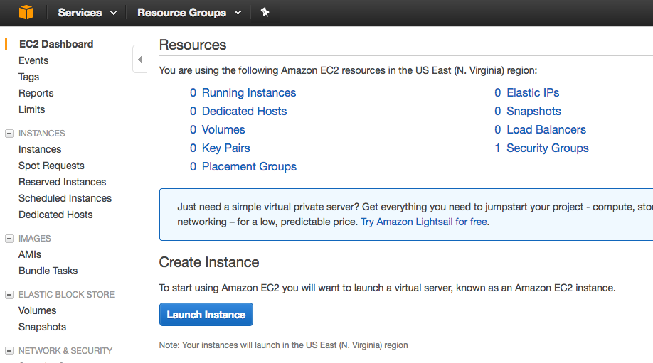

## Setting up Classic Load Balancer (CLB)

- Login to [AWS Console](https://aws.amazon.com/console/)
- Go to the Amazon EC2 Service
- Firing Up the EC2 Instance
    - Log into the AWS console. Select EC2 and then Launch Instance:
    
    - Choose the type of Operating System for our EC2 Virtual Machine
        - The Amazon Linux AMI comes with a whole lot of pre-built in tools including the AWS CLI, the popular programming languages and databases.
        - We will choose `Amazon Linux 2 AMI (HVM), SSD Volume Type`
    - Please choose `t2.micro` as instance type
    - in `Configure Instance Details`, choose default for everything excewprt `userdata`
        - VPC stands for Virtual Private Cloud.
        - One subnet is tied to one Availability Zone.
        - IAM stands for Identity Access Management and is used to manage permissions.

